<p align="center">
  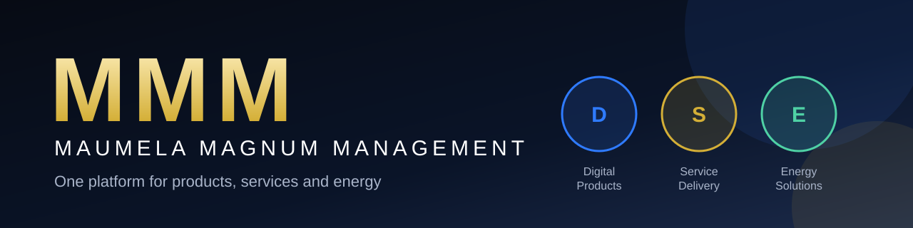
</p>

<p align="center">
  <a href="https://github.com/dmaumela23/MMM-2026/actions/workflows/backend-ci.yml"></a>
  <a href="https://github.com/dmaumela23/MMM-2026/actions/workflows/android-ci.yml"></a>
  
  
  
</p>

# Maumela Magnum Management (MMM)

> **One platform for products, services and energy.** A university prototype: an Android app (Kotlin, Jetpack Compose) backed by a REST API (FastAPI) and a PostgreSQL database.


**Scope notes.** The Energy module runs on **simulated data** and is not connected to any electricity meter or grid. **No payments** are processed: orders are recorded only. MMM is a prototype, not a production system (see [Limitations](#10-limitations-and-future-work)).

## Contents
1. [Purpose of the app](#1-purpose-of-the-app)
2. [Research that shaped the design](#2-research-that-shaped-the-design)
3. [The app in pictures](#3-the-app-in-pictures)
4. [Design considerations](#4-design-considerations)
5. [Technology and why it was chosen](#5-technology-and-why-it-was-chosen)
6. [GitHub and GitHub Actions](#6-github-and-github-actions)
7. [Getting started](#7-getting-started)
8. [Testing](#8-testing)
9. [Learning outcomes](#9-learning-outcomes)
10. [Limitations and future work](#10-limitations-and-future-work)
11. [About this project](#11-about-this-project)

---

## 1. Purpose of the app

### The problem
Maumela Magnum Management is a business that sells a wide range of things: software and digital goods, professional services, and, in future, energy supply. Customers, freelancers and companies each need something different, but no single app presents these as one coherent offering. Existing platforms are built around **one** kind of exchange (a shop, a freelancer market, or a project board), so a company with several lines of business ends up with several disconnected tools.

### What MMM does
MMM is a **multi-sector digital platform**. One account gives access to three sectors:

| Sector | What users can do |
|---|---|
| **Digital Products** | Browse, search and order digital goods such as software licences and templates |
| **Service Delivery** | Browse and request professional services; providers accept the request and move it through to completion |
| **Energy Solutions** | View a (simulated) energy plan, usage history, monthly reports and cost estimates |

### Who it is for
| Account type | Can do |
|---|---|
| **Customer** | Browse, search, filter, order, track orders, manage their profile and settings |
| **Service Provider** | Everything a customer can, plus create and manage their own **services** and process incoming service requests |
| **Business** | Everything above, plus create and manage their own **products** and process incoming product orders |

### Scope
**In scope:** registration and login, product/service catalogue with server-side search and filtering, product and service management, orders with a status workflow, a simulated energy dashboard, user settings, push-notification infrastructure.
**Out of scope (deliberately):** payments, real energy-meter integration, image upload (products use image links), a reviews system (ratings are stored values), server-triggered push notifications.

---

## 2. Research that shaped the design

Part 1 of the project compared three platforms. MMM combines the useful ideas from each and gives them one identity.

| Platform | What it does well | Idea MMM took |
|---|---|---|
| **Shopify** | Product catalogue, orders, scalable and modular architecture | Product management and CRUD, order handling, a **sector field** so new business areas can be added as data rather than rewritten code |
| **Fiverr** | Service listings, categories, simple ordering, seller profiles, ratings | Service listings with categories, ratings, estimated delivery time and a simple "request this service" flow |
| **Upwork** | Client/provider relationships, project-based work, milestones, reputation | A **provider workflow**: every order line has its own status (Pending, Accepted, In progress, Completed) that the provider controls, so a project is tracked step by step |


---

## 3. The app in pictures

> The images below live in [`docs/images/screenshots/`](docs/images/screenshots/). Replace them with your own screenshots.

<table>
  <tr>
    <td align="center">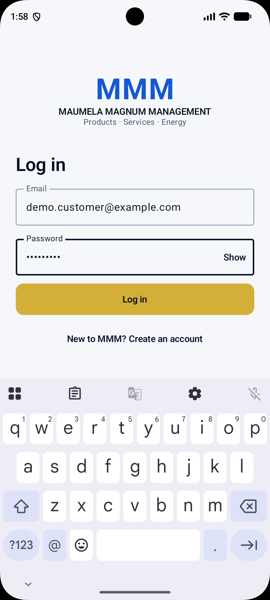<br><sub><b>Login</b><br>Validation and friendly errors</sub></td>
    <td align="center">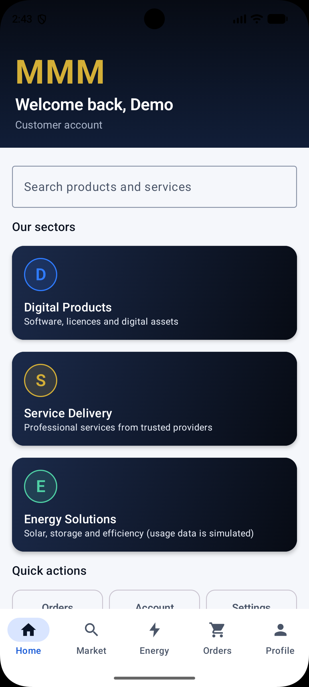<br><sub><b>Home</b><br>Three sectors, search, featured items</sub></td>
    <td align="center">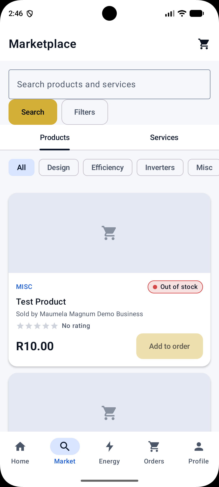<br><sub><b>Marketplace</b><br>Products and Services tabs</sub></td>
  </tr>
  <tr>
    <td align="center">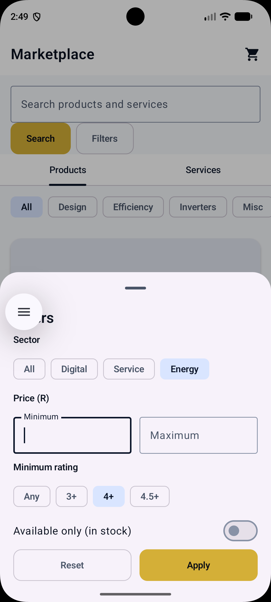<br><sub><b>Filters</b><br>Applied by the server in SQL</sub></td>
    <td align="center"><br><sub><b>Product details</b><br>Stock, seller, rating, quantity</sub></td>
    <td align="center">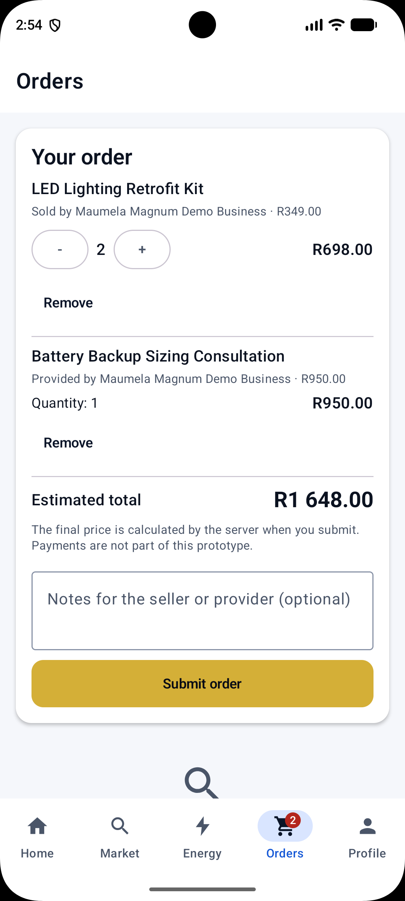<br><sub><b>Orders</b><br>Draft checkout and history</sub></td>
  </tr>
  <tr>
    <td align="center"><br><sub><b>Order details</b><br>Per-line status, server total</sub></td>
    <td align="center">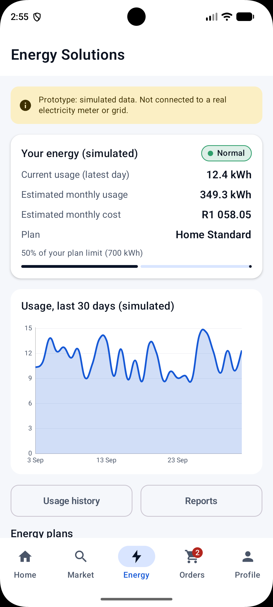<br><sub><b>Energy (simulated)</b><br>Usage, plan, cost, chart</sub></td>
    <td align="center">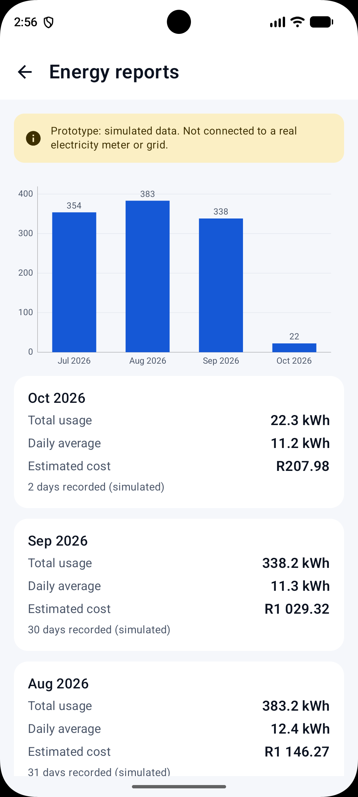<br><sub><b>Energy reports</b><br>Monthly totals</sub></td>
  </tr>
  <tr>
    <td align="center">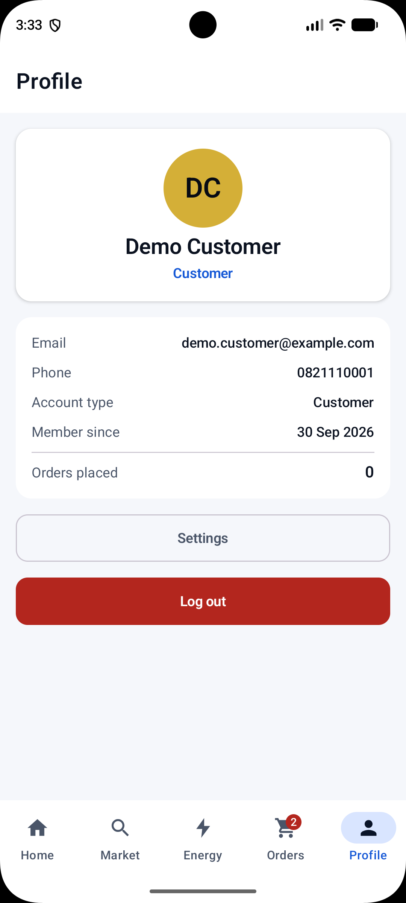<br><sub><b>Profile</b><br>Account and my listings</sub></td>
    <td align="center">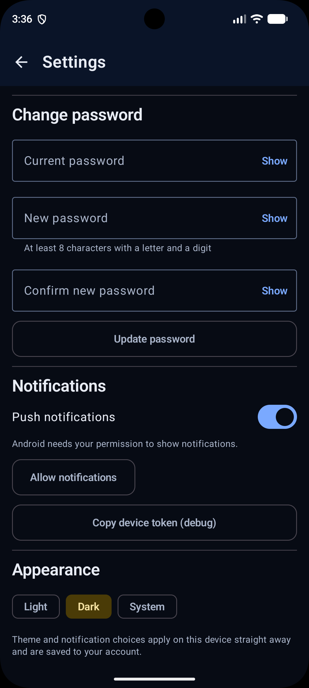<br><sub><b>Settings</b><br>Dark mode, password, notifications</sub></td>
  </tr>
</table>

---

## 4. Design considerations

### 4.1 Product and interface design
**Brand.** The look is meant to say *innovation, scale, trust and energy*: deep navy and black for authority, gold for the main call to action, electric blue for technology, and white/grey for clarity. The palette is defined once in the theme and reused everywhere.

<p align="center">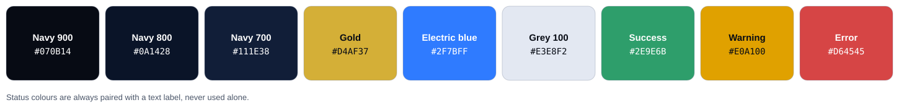</p>

**Design principles that guided the screens**
- **Business first, not a shop clone.** The home screen leads with the three sectors, not a product grid.
- **One set of reusable components.** Buttons, text fields, product/service cards, status chips, banners and the editor sheet are built once and reused, so every screen behaves the same way.
- **Every screen has four honest states:** loading, error (with *Try again*), empty, and content. A failed request is a state, never a crash.
- **Colour never carries meaning alone.** Status chips always show a text label; ratings have a spoken description; charts have a text summary for screen readers; touch targets are at least 48 dp.
- **Light and dark themes** follow the user's choice (Light, Dark or System) and apply instantly.
- **Role-aware screens.** A Customer never sees an "Add product" button; a Provider sees incoming requests.

**Navigation.** A single navigation graph with a bottom bar for the five top-level areas.

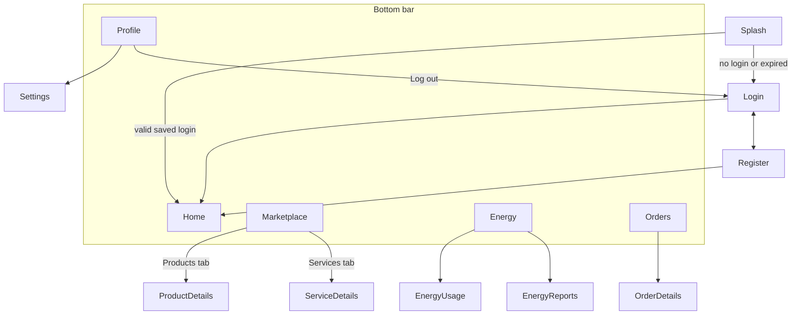

### 4.2 Architecture
The app follows MVVM with a repository layer. The UI never talks to the network directly.

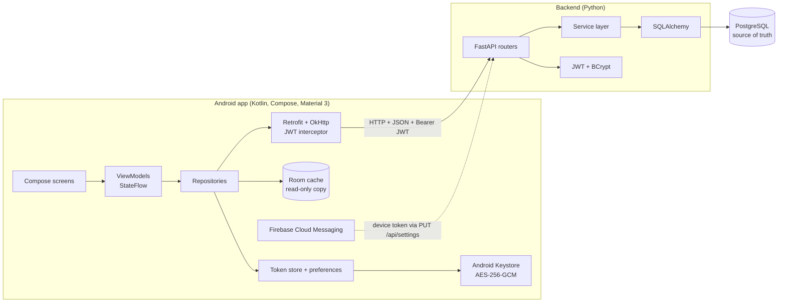

| Layer | Responsibility | Rule it enforces |
|---|---|---|
| Composable screens | Draw state, send user events | No network calls, no business logic |
| ViewModel | Hold `StateFlow<UiState>` | Survives rotation; contains no UI classes |
| Repository | Single door to data; maps errors | Never throws: returns `Success` or `Failure` |
| Retrofit / OkHttp | HTTP calls, JWT header | One place that talks to the server |
| FastAPI routers → services → models | HTTP, business rules, persistence | Routers are thin; rules live in services |

**Order creation** shows why the server owns the important decisions:

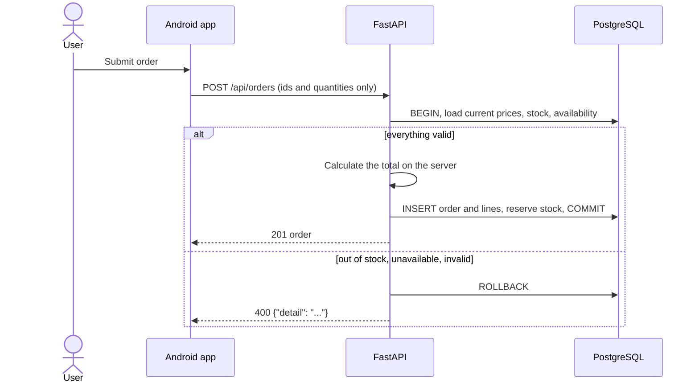
More diagrams (registration, login, product retrieval): [`docs/sequence-diagrams.md`](docs/sequence-diagrams.md).

### 4.3 Data design
Eight tables with primary and foreign keys, indexes, `created_at`/`updated_at`, and database-level `CHECK` constraints (for example: price must be positive, an order line must reference exactly one of a product or a service).

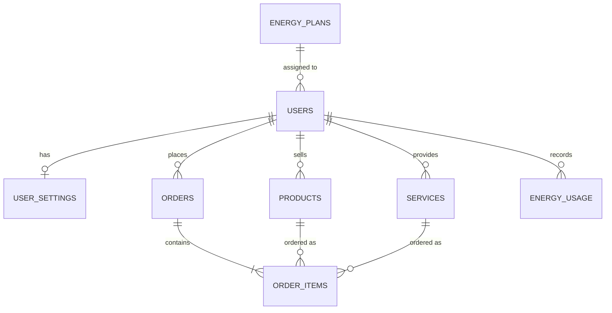

Key data decisions:
- **Money is never a floating-point number.** The database uses `NUMERIC(12,2)`, the API sends decimal strings such as `"1499.00"`, and the app holds `BigDecimal`.
- **The price is frozen at order time** (`unit_price` on the order line), so changing a product's price later never rewrites history.
- **Per-line status.** A product or service order line has its own status. The order's overall status is *derived* from its lines, so an order can never be stuck at "Pending" forever.
- **Deleting a product that has been ordered is blocked** (HTTP 409). It must be marked unavailable instead, so order history stays intact.

### 4.4 API design
REST over JSON, one error shape (`{"detail": "..."}`), and correct status codes.

| Code | Used for |
|---|---|
| 200 / 201 | Success / created |
| 400 | Validation failure or a refused business rule (out of stock, invalid status change) |
| 401 | Missing, invalid or expired token; wrong credentials |
| 403 | Authenticated but not allowed (wrong role, not the owner) |
| 404 | Not found |
| 409 | Conflict (email already registered, listing has order history) |
| 500 | Unexpected error; generic message, details only in the server log |

Interactive documentation is generated automatically at `/docs` (Swagger).

### 4.5 Security design
| Concern | Design |
|---|---|
| Passwords | **BCrypt** with a random salt per password. Hashing is one-way, unlike encryption, so nobody (including the server) can recover a password, and a leaked database yields hashes that must be cracked one by one |
| Sessions | **JWT** (HS256) with an expiry; the secret comes from an environment variable |
| Authorisation | Role and ownership checked on **every** request on the server. Hiding a button in the app is convenience only |
| Input | Pydantic validation on the server, the same rules on the device; **parameterised SQL** through SQLAlchemy; `%` and `_` in searches are escaped |
| Token on the phone | Encrypted with an **Android Keystore** AES-256-GCM key that never leaves secure storage; if it cannot be decrypted, the user is simply logged out |
| Money | The server loads prices from the database and calculates totals. The app never sends a price |
| Secrets | `.env`, `local.properties` and `google-services.json` are git-ignored; only `.env.example` is committed |
| Transport | HTTPS is required for any real deployment. Plain HTTP is allowed in **debug builds only** (for the local emulator and phone) |

### 4.6 Reliability: errors and offline use
- **Every repository call returns a result, never an exception**, so a failed request can't crash the app.
- Friendly messages for no internet, an unreachable server, 400, 401, 403, 404, 409 and 500. A 5xx never shows server details.
- A **401 anywhere** (expired session) clears the session and returns the user to Login with a message.
- **Offline behaviour.** If the network fails, the Marketplace and order list show a saved copy from the local Room database with a "Showing saved data" banner. The cache is only a copy: the server remains the source of truth, it is rebuilt from server responses, and it is wiped on logout. A server error is never hidden behind old data.

### 4.7 Key decisions and trade-offs
| Decision | Why | Trade-off accepted |
|---|---|---|
| One FastAPI backend, no microservices | A prototype should be understandable end to end | Would be split up at much larger scale |
| Manual dependency injection instead of Hilt | Less setup and fewer moving parts to explain | More wiring code by hand |
| Limited Room cache | Offline browsing without a sync engine | Cached data can be slightly stale; no offline writes |
| Server-side filtering | The data really changes; consistent with the database | Needs the network (the cache applies the same rules offline) |
| Tables created at start-up, no migrations | Simple for a prototype | Schema changes need a recreate, not a migration |
| JWT without refresh tokens | Simple, stateless | No server-side revocation; documented limitation |
| Validation errors return 400, not FastAPI's 422 | Matches the specified status-code set | One constant in `error_handlers.py` switches it back |
| Simulated energy data from a deterministic generator | Honest, repeatable demos and tests | Not real consumption data |

### 4.8 Challenges and lessons learned

- **Emulator networking.** Inside the Android emulator, `localhost` is the emulator itself. The computer is reached at `10.0.2.2`, and a physical phone needs the PC's LAN address or `adb reverse`.
- **OneDrive and Gradle.** OneDrive locked Gradle's build files and caused "Unable to delete directory" errors. Moving the project out of OneDrive fixed it.
- **A new Android Gradle Plugin.** AGP 9 compiles Kotlin itself, so older build-file advice no longer applied and every version had to be checked for compatibility.
- **Bugs found by review, not by tests.** A product-only order could never leave "Pending"; the fix was per-line statuses with a derived order status. Later, a code review caught that Providers and Businesses could not see the orders they had placed; this is now covered by a unit test.
- **BCrypt's 72-byte limit.** Passwords are limited to 64 characters so the hash can never silently ignore part of a long password.
- **Careless copy/paste.** Several build errors came from pasting a file header onto the end of a line. A syntax check over all files (`python -m compileall`) finds these in one go.

---

## 5. Technology and why it was chosen

| Technology | Purpose in MMM |
|---|---|
| **Kotlin**, Android Studio | The Android language and IDE; null-safety and coroutines keep async code short and safe |
| **Jetpack Compose + Material 3** | Declarative UI, one reusable component library, light/dark theming |
| **Navigation Compose** | One navigation graph with typed arguments and back-stack handling |
| **ViewModel + StateFlow** | Screen state survives rotation; the UI only observes state |
| **Retrofit + OkHttp** *(external library)* | Turns a Kotlin interface into HTTP calls; the interceptor attaches the JWT and detects expired sessions |
| **kotlinx.serialization** | JSON parsing |
| **MPAndroidChart** *(external library)* | Line and bar charts for the energy data |
| **Coil** | Loads product images from links |
| **Room** | The small read-only offline cache |
| **DataStore + Android Keystore** | Preferences and the encrypted login token |
| **Firebase Cloud Messaging** *(SDK)* | Push-notification infrastructure: device token registration and Console test messages |
| **FastAPI** | REST framework with automatic Swagger documentation |
| **PostgreSQL + SQLAlchemy** | Relational database and ORM with parameterised queries |
| **Pydantic** | Input validation on the server |
| **PyJWT, BCrypt** | Authentication and password hashing |
| **JUnit, MockK, pytest** | Unit tests on the app and the API |
| **GitHub + GitHub Actions** | Version control, review and automated testing (next section) |

---

## 6. GitHub and GitHub Actions

### 6.1 How the repository is used
```
MMM/
├── .github/
│   ├── workflows/        backend-ci.yml, android-ci.yml   (GitHub Actions)
│   ├── ISSUE_TEMPLATE/   bug report, feature request
│   ├── pull_request_template.md
│   └── dependabot.yml
├── backend/              FastAPI app, tests, seed script
├── android/              Android Studio project
└── docs/                 diagrams, screenshots, checklists
```

| Practice | How it is applied here |
|---|---|
| **One repository, two projects** | A single repo holds backend, app and documentation so a change to the API and the app that uses it travel together |
| **Branches** | `main` is always working. New work happens on short-lived branches such as `feature/orders-screen` or `fix/provider-orders` and is merged by **pull request** |
| **Commits** | Small commits with messages that say what and why (for example `Fix: providers could not see their own orders`) |
| **Pull requests** | Every PR uses the [pull request template](.github/pull_request_template.md): what changed, why, how it was tested, and a no-secrets checklist. CI must be green before merging |
| **Issues** | Bugs and ideas are tracked as issues using the templates in `.github/ISSUE_TEMPLATE`; PRs reference them (`Closes #12`) |
| **Keeping secrets out** | A root [`.gitignore`](.gitignore) excludes `.env`, `local.properties` and `google-services.json`. Only `.env.example` is committed. CI creates its own throw-away secrets |
| **Dependency updates** | [Dependabot](.github/dependabot.yml) opens pull requests for new Python, Gradle and Actions versions; the CI below tests each one automatically |
| **Evidence of progress** | Commit history, closed issues, merged pull requests and tagged releases (for example `v1.0.0-prototype`).|

### 6.2 GitHub Actions: continuous integration
Two workflows run automatically. Each one answers the question *"does the project still work after this change?"* without anyone having to remember to check.

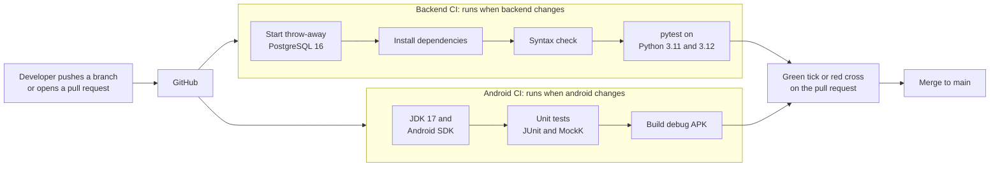

| Workflow | File | Runs when | What it does | What it proves |
|---|---|---|---|---|
| **Backend CI** | [`backend-ci.yml`](.github/workflows/backend-ci.yml) | Push to `main` or a pull request that changes `backend/` | Starts a PostgreSQL 16 service container, installs dependencies, syntax-checks every file, runs the whole `pytest` suite on **Python 3.11 and 3.12**, uploads the test report | The API, security rules, order logic and database constraints work against a **real** PostgreSQL, on a clean machine |
| **Android CI** | [`android-ci.yml`](.github/workflows/android-ci.yml) | Push to `main` or a pull request that changes `android/` | Sets up JDK 17, the Android SDK and Gradle (cached), runs `testDebugUnitTest`, builds the debug APK, uploads the test report and the APK | The app **compiles from a clean checkout** (no hidden local files) and its unit tests pass |

Design choices in the workflows:
- **Path filters**: only the affected project is tested, which saves time.
- **Concurrency**: a newer push cancels the older, now-pointless run.
- **Least privilege**: `permissions: contents: read`, so the workflows cannot change the repository.
- **No stored secrets**: the JWT secret is generated fresh for every run, and the throw-away CI database holds no real data.
- **Artifacts**: the test reports and a ready-to-install debug APK are attached to each run, so a reviewer can try the exact build.
- **Matrix**: the backend is tested on two Python versions to catch version-specific problems.
- **A clean-clone check for free**: because the build has no `google-services.json` and no `.env`, CI also proves the app and API start without private files.

### 6.3 Evidence

| Screenshot | File |
|---|---|
| A green Backend CI run | `docs/images/screenshots/github-backend-ci.png` |
| A green Android CI run | `docs/images/screenshots/github-android-ci.png` |
| A pull request showing both checks passing | `docs/images/screenshots/github-pull-request-checks.png` |

<p align="center">
  
</p>

### 6.4 Run the same checks on your own machine
| Check | Command |
|---|---|
| Backend tests | `cd backend` then `pytest -v` |
| Android tests | `cd android` then `.\gradlew.bat testDebugUnitTest` |
| Debug build | `cd android` then `.\gradlew.bat assembleDebug` |

---

## 7. Getting started

### Prerequisites
| Tool | Version |
|---|---|
| Android Studio | Quail 4 (2026.1.4) or newer, JDK 17 |
| Python | 3.11 or 3.12 |
| PostgreSQL | 15 or 16 |

Keep the project **outside OneDrive** (for example `C:\dev\MMM`); OneDrive locks Gradle's build files.

### Backend
```powershell
cd backend
python -m venv .venv
.venv\Scripts\Activate.ps1
pip install -r requirements.txt
copy .env.example .env      # then fill in the values
```
1. **PostgreSQL** (as a superuser):
   ```sql
   CREATE ROLE mmm_user WITH LOGIN PASSWORD 'choose-a-strong-password';
   CREATE DATABASE mmm OWNER mmm_user;
   CREATE DATABASE mmm_test OWNER mmm_user;
   ```
2. **`backend/.env`**: `DATABASE_URL`, `TEST_DATABASE_URL` (name must end in `_test`), `JWT_SECRET` (`python -c "import secrets; print(secrets.token_hex(32))"`), `SEED_DEMO_PASSWORD`.
3. **Seed demo data:** `python seed.py` creates `demo.customer@example.com`, `demo.provider@example.com` and `demo.business@example.com` (password = your `SEED_DEMO_PASSWORD`), 12 products, 10 services, 3 energy plans and simulated usage.
4. **Run:** `uvicorn app.main:app --host 0.0.0.0 --port 8000 --reload`, then open <http://localhost:8000/docs>.

### Android app
1. Open `android/` in Android Studio and let Gradle sync.
2. Create an emulator with a **Google Play** system image.
3. Start the backend, then run the `app` configuration.

**Connecting the app to the backend.** The address is the build setting `MMM_BASE_URL` (default `http://10.0.2.2:8000/api/`). Override it in `android/local.properties` (never committed):

| Where the app runs | `MMM_BASE_URL` | Notes |
|---|---|---|
| Android emulator | `http://10.0.2.2:8000/api/` (default) | `10.0.2.2` is the emulator's alias for your computer's `localhost` |
| Phone on Wi-Fi | `http://<PC-LAN-IP>:8000/api/` | Same network (no client isolation), start uvicorn with `--host 0.0.0.0`, allow TCP 8000 on **Private** networks in Windows Firewall |
| Phone over USB | `http://localhost:8000/api/` | Run `adb reverse tcp:8000 tcp:8000` |

### Firebase Cloud Messaging (optional, needs your own project)
1. Create a free project at <https://console.firebase.google.com> and add an Android app with the package name **`com.maumela.magnummanagement`**.
2. Put the downloaded `google-services.json` in `android/app/` (it is git-ignored) and sync.
3. In the app: **Settings → Copy device token (debug)**. In the Firebase Console: **Messaging → Send test message**, paste the token, and put the app in the background.

Without the file the app still builds and runs; Settings explains that notifications are unavailable.

### Troubleshooting
| Problem | Fix |
|---|---|
| "Can't reach the MMM server" | Is uvicorn running? Emulator must use `10.0.2.2`. Phone: check `MMM_BASE_URL`, Wi-Fi, firewall, `--host 0.0.0.0` |
| `Unable to delete directory ...\build` | OneDrive or antivirus is locking files. Move the project out of OneDrive and run `.\gradlew.bat --stop` |
| Backend `jwt_secret` validation error | `JWT_SECRET` missing or shorter than 32 characters |
| Backend tests refuse to run | `TEST_DATABASE_URL` must name a database ending in `_test` |
| No test notification | Use a Google Play emulator image, allow notifications (Android 13+), put the app in the background |

---

## 8. Testing
| Suite | Tools | What it covers |
|---|---|---|
| **Backend** | pytest, FastAPI TestClient, a separate `_test` PostgreSQL database | Registration and login, BCrypt hashing, JWT protection, roles and ownership, product/service CRUD and filters, order totals and stock, status workflow, energy data, settings, error shapes |
| **Android** | JUnit 4, MockK, coroutines-test | Validators, price and energy calculators, formatters, offline filters, repositories (success, error and cache fallback), ViewModels, token storage, permission and order rules |


<p align="center">
  
</p>

Both suites also run automatically on every push through GitHub Actions ([section 6](#6-github-and-github-actions)).

---

## 9. Learning outcomes

| Learning outcome | Implementation | Evidence |
|---|---|---|
| Use a RESTful API in an Android app | Retrofit calls to FastAPI with JSON, correct verbs and status codes, JWT auth | Marketplace and orders load from the API; Swagger at `/docs` |
| The API connects to a database | FastAPI, SQLAlchemy, PostgreSQL; 8 tables with keys and constraints | Rows appear in `users`, `orders`, `energy_usage` after using the app |
| Use an external library | **Retrofit + OkHttp** (networking), **MPAndroidChart** (charts), Coil (images) | `ApiService.kt`, `RetrofitClient.kt`, `EnergyChart.kt` |
| Connect to an SDK | **Firebase Cloud Messaging** | Token stored in `user_settings`; Console test notification |
| Detailed unit testing | JUnit, MockK, pytest | Green runs locally and in GitHub Actions |
| Fully working prototype | Register, browse, order, track, energy, settings | Demo video |
| Runs on a physical phone | LAN or `adb reverse` | Demo video |
| Registration, login, secure password storage | BCrypt hashes, JWT, Keystore-encrypted token | `password_hash` column; security tests |
| User settings | Profile, password, notifications, theme | Dark mode persisted |
| Part 1 features | Shopify, Fiverr and Upwork ideas ([section 2](#2-research-that-shaped-the-design)) | Provider workflow, listings, ratings |

---

## 10. Limitations and future work
**Limitations (a prototype, not a production system)**
- No refresh tokens or server-side token revocation; no rate limiting or account lockout; no email verification
- HTTP (not HTTPS) during development; the Room cache is not encrypted
- Energy data is simulated; no payments; ratings are stored values (no review system); no image upload
- Seller buttons on an order line are matched by name for display only; the server remains the authority
- Notifications are received from the Firebase Console only; the server does not send them

**Future work**
- Server-triggered notifications when an order line changes status (Firebase Admin SDK)
- Real payment provider, reviews and ratings, image upload
- Database migrations (Alembic), refresh tokens, HTTPS deployment, a deployed CI/CD pipeline
- Real smart-meter integration for the Energy sector, and additional sectors added through the sector registry

---

**Author:** Dakalo D. Maumela · **Course:** Open Source Coding / OPSC6312 · **Year:** 2026

**What I learned:** In conclusion from this Part 2 I learned much about managing a database in PostgreSQL, making the right decision when creating and using an emulator in Android Studio. I also additionally learnt from mistakes whether it be in written code or architecture and the mishandling of files. A big learning curve additionally is the RestAPI and its connection issues. Understandably I learnt that in the more i prep the better it will be since errors and mishaps are always certain to arise.

**Acknowledgements:** Institution: Emeris, Lectrurer: Terrence Maphogo
