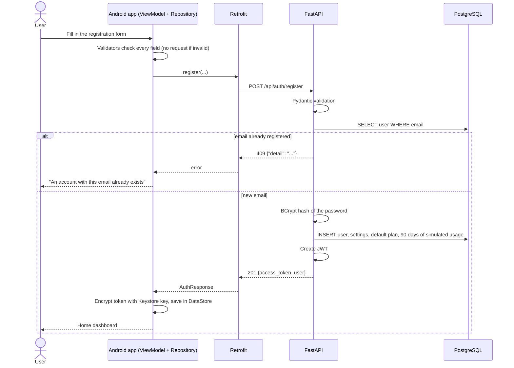
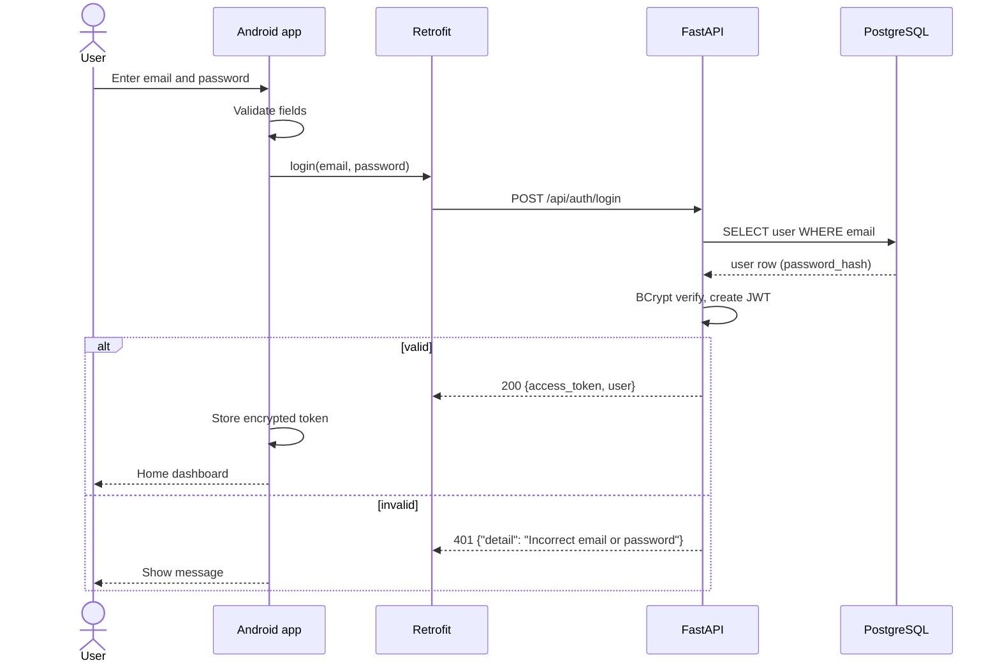
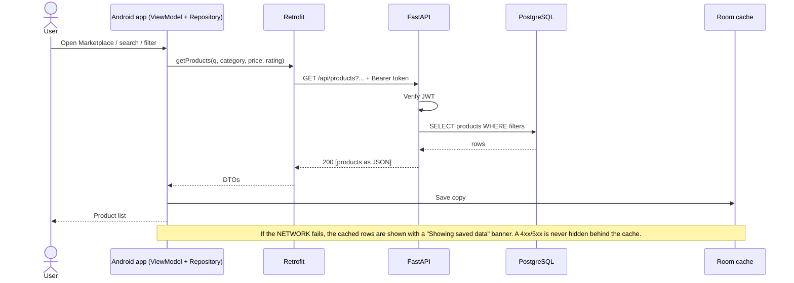
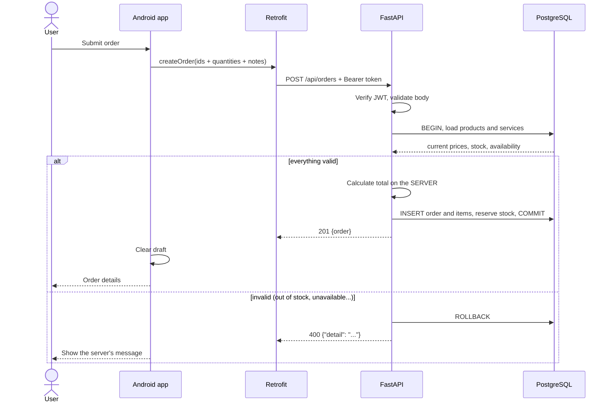
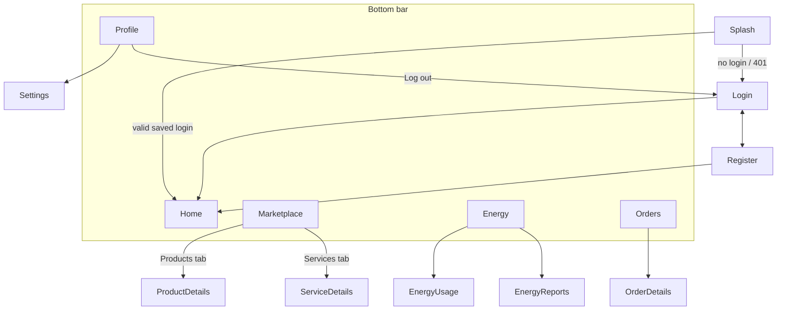

# MMM sequence diagrams (Mermaid)

## Registration

```mermaid
sequenceDiagram
    actor U as User
    participant A as Android app (ViewModel + Repository)
    participant R as Retrofit
    participant F as FastAPI
    participant D as PostgreSQL
    U->>A: Fill in the registration form
    A->>A: Validators check every field (no request if invalid)
    A->>R: register(...)
    R->>F: POST /api/auth/register
    F->>F: Pydantic validation
    F->>D: SELECT user WHERE email
    alt email already registered
        F-->>R: 409 {"detail": "..."}
        R-->>A: error
        A-->>U: "An account with this email already exists"
    else new email
        F->>F: BCrypt hash of the password
        F->>D: INSERT user, settings, default plan, 90 days of simulated usage
        F->>F: Create JWT
        F-->>R: 201 {access_token, user}
        R-->>A: AuthResponse
        A->>A: Encrypt token with Keystore key, save in DataStore
        A-->>U: Home dashboard
    end
```

## Login

```mermaid
sequenceDiagram
    actor U as User
    participant A as Android app
    participant R as Retrofit
    participant F as FastAPI
    participant D as PostgreSQL
    U->>A: Enter email and password
    A->>A: Validate fields
    A->>R: login(email, password)
    R->>F: POST /api/auth/login
    F->>D: SELECT user WHERE email
    D-->>F: user row (password_hash)
    F->>F: BCrypt verify, create JWT
    alt valid
        F-->>R: 200 {access_token, user}
        A->>A: Store encrypted token
        A-->>U: Home dashboard
    else invalid
        F-->>R: 401 {"detail": "Incorrect email or password"}
        A-->>U: Show message
    end
```

## Product retrieval (with offline fallback)

```mermaid
sequenceDiagram
    actor U as User
    participant A as Android app (ViewModel + Repository)
    participant R as Retrofit
    participant F as FastAPI
    participant D as PostgreSQL
    participant C as Room cache
    U->>A: Open Marketplace / search / filter
    A->>R: getProducts(q, category, price, rating)
    R->>F: GET /api/products?... + Bearer token
    F->>F: Verify JWT
    F->>D: SELECT products WHERE filters
    D-->>F: rows
    F-->>R: 200 [products as JSON]
    R-->>A: DTOs
    A->>C: Save copy
    A-->>U: Product list
    Note over A,C: If the NETWORK fails, the cached rows are shown with a "Showing saved data" banner. A 4xx/5xx is never hidden behind the cache.
```

## Creating an order

```mermaid
sequenceDiagram
    actor U as User
    participant A as Android app
    participant R as Retrofit
    participant F as FastAPI
    participant D as PostgreSQL
    U->>A: Submit order
    A->>R: createOrder(ids + quantities + notes)
    R->>F: POST /api/orders + Bearer token
    F->>F: Verify JWT, validate body
    F->>D: BEGIN, load products and services
    D-->>F: current prices, stock, availability
    alt everything valid
        F->>F: Calculate total on the SERVER
        F->>D: INSERT order and items, reserve stock, COMMIT
        F-->>R: 201 {order}
        A->>A: Clear draft
        A-->>U: Order details
    else invalid (out of stock, unavailable...)
        F->>D: ROLLBACK
        F-->>R: 400 {"detail": "..."}
        A-->>U: Show the server's message
    end
```

## Navigation

```mermaid
flowchart TD
    Splash -->|valid saved login| Home
    Splash -->|no login / 401| Login
    Login <--> Register
    Login --> Home
    Register --> Home
    subgraph Bottom bar
        Home
        Marketplace
        Energy
        Orders
        Profile
    end
    Marketplace -->|Products tab| ProductDetails
    Marketplace -->|Services tab| ServiceDetails
    Energy --> EnergyUsage
    Energy --> EnergyReports
    Orders --> OrderDetails
    Profile --> Settings
    Profile -->|Log out| Login
```
